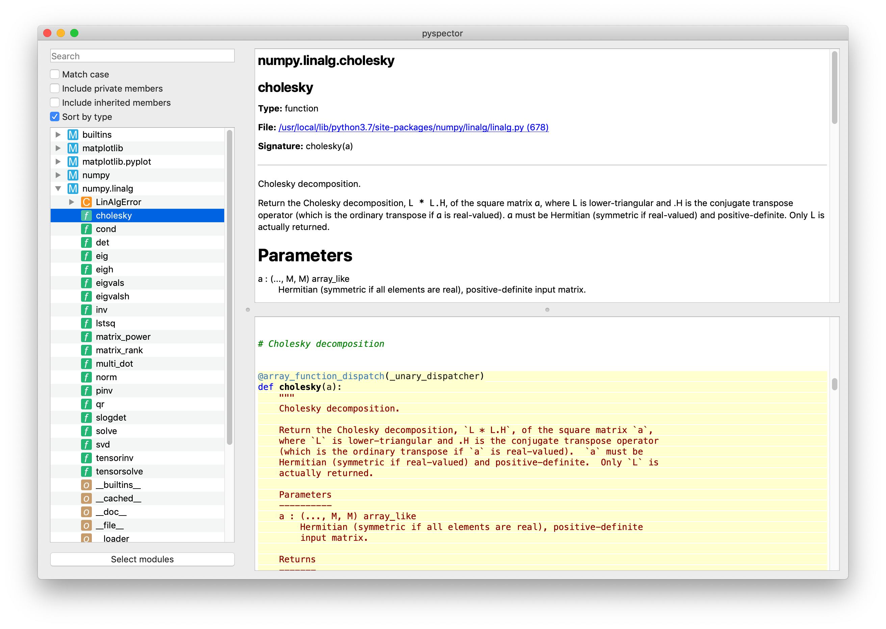
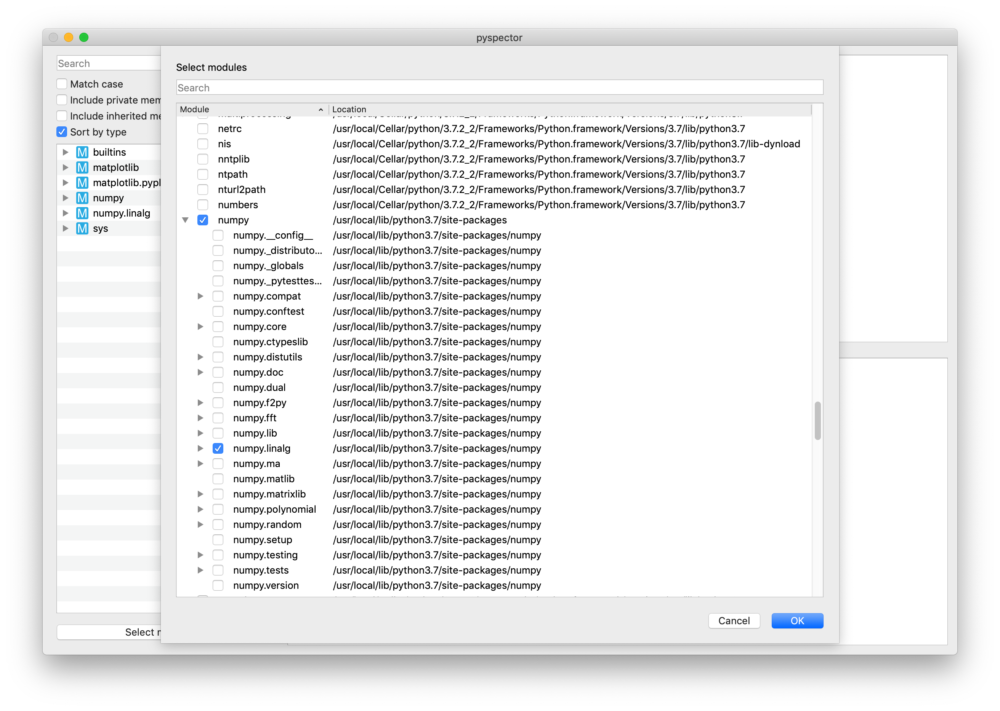

# pyspector

`pyspector` offers a simple user interface for inspecting Python modules. Here are some of the key features:

- Expand a module to see all the classes, functions, and objects defined in that modules.
- Expand a class to see all the methods and objects defined in that class.
- Select a module, class, or function to see detailed information, including base classes, derived, classes, call signatures, documentation, and source code (when available).




## Prerequisites

To run `pyspector`, you'll need [Python 3.7.2](https://www.python.org/downloads/) or later, as well as the following Python packages:

```sh
pip3 install docutils
pip3 install markdown
pip3 install PyQt5
```


## Running the application

You can run `pyspector` from the command line as follows:

```sh
python3 src/main.py
```

If you've got [Visual Studio Code](https://code.visualstudio.com/) and the
[Python extension for VS Code](https://marketplace.visualstudio.com/items?itemName=ms-python.python), you can run `pyspector` by opening the containing folder and launching using the "Python: Module" launch configuration.

Once the application is running, you can choose which modules to inspect by pressing the "Select modules" button in the bottom-left corner. Be patient, as it may take a little while to discover all the modules in your python installation. Check each of the modules you want to inspect, then press "OK."



The left side of the main application window displays the modules you've selected as a hierarchy. You can expand a module in this tree view to reveal the classes, functions, and objects defined (or imported) by that module. Likewise, you can expand a class to reveal any methods, properties, and objects defined within that class. Here's a guide to the icons shown in the tree view:

Icon                                       | Meaning
------------------------------------------ | ------------------------------------
  | module
 | abstract base class
    | class
 | property
 | function or method
   | object (an instance of anything else)

When you select an item in the tree view, `pyspector` displays detailed information about that module, class, function, or object on the right side of the application. You'll see its type, any documentation associated with it, base classes and derived classes (for classes), and call signatures (for functions), as well as the source code (assuming `pyspector` can locate the source).


## Development

You're welcome to contribute to the development of `pyspector`. Feel free to address any of the existing [issues](../../issues) or open new issues. Please submit a pull request from a fork of the code if you've developed a fix or an improvement.
